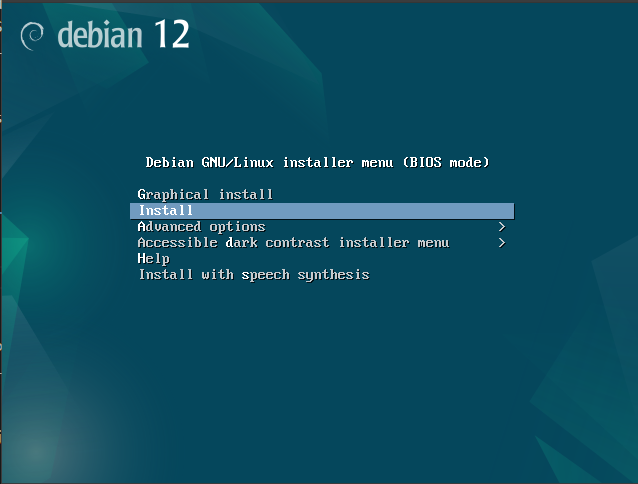
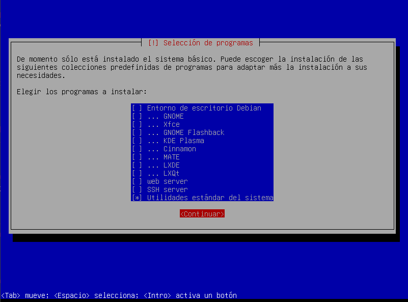
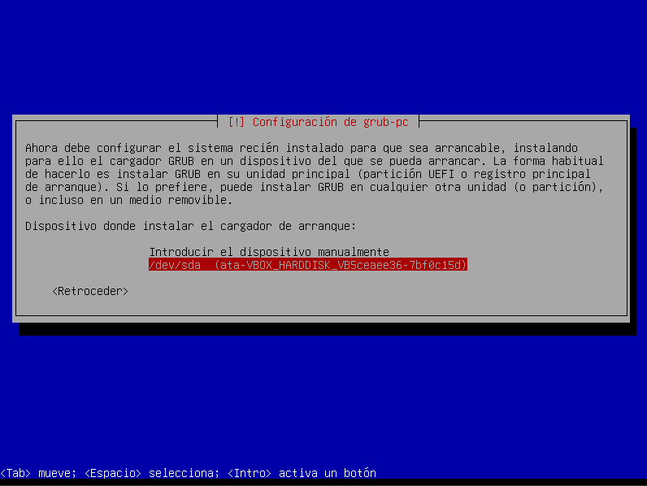

# 1. Instalación

[1.0 Antes de Iniciar](#10-antes-de-iniciar)

[1.1 Guía de Instalación de Debian 12 'Bookworm'](#11-guia-de-instalacion-de-debian-12-bookworm)


>No creo necesariamente que la instalación sea la única opción.
>Es solo una etiqueta para ciertos tipos de arreglos.
>
> __— Barbara Kruger__

## 1.0 Antes de Iniciar
> __Nota__
> Esta guía está basada en la versión oficial Debian 12 "Bookworm", también conocida como "estable" ("stable") y la pagina https://servidordebian.org/.  
>
> Para obtener más información sobre las versiones de Debian GNU/Linux, consulta Versiones/Lanzamientos Debian.

__Preparar el dispositivo de instalación__

La forma más fácil de instalar Debian es mediante un CD-ROM o una unidad USB. Desde Internet, puedes descargar una imagen de instalación en formato ISO (archivo con la extensión ".iso") para grabarla en un CD o preparar una unidad USB con esa imagen.

En los espejos (mirrors) de Debian, hay diversas imágenes de CD y DVD de instalación, desde un  CD de 670 MB hasta un el DVD con varios GB que contienen el top del software disponible en los repositorios de Debian.

Como el objetivo es instalar un servidor, la mejor opción es realizar una instalación mínima y luego instalar los paquetes necesarios desde Internet. Para esto, basta con descargar una imagen pequeña de "netinst" (aproximadamente 670 MB) desde los servidores de [Debian.org](https://www.debian.org).
Para descargar el archivo ISO, selecciona un espejo de Debian cercano. La lista de espejos está disponible en [https://www.debian.org/CD/http-ftp](https://www.debian.org/CD/http-ftp).

### Descargar el archivo ISO de instalación
__Soporte para múltiples arquitecturas__
Debian 12 "Bookworm" permite instalar paquetes de múltiples arquitecturas en la misma máquina. Esto significa que puedes instalar software de 32 bits y 64 bits simultáneamente, con todas las dependencias correctamente gestionadas de forma automática.

Puedes descargar el archivo ISO para múltiples arquitecturas desde:
[https://www.debian.org/CD/http-ftp/](https://www.debian.org/CD/http-ftp/).

Si prefieres instalar una versión específica para la arquitectura de tu máquina, puedes descargar un archivo ISO más pequeño desde:

[https://cdimage.debian.org/debian-cd/current/i386/iso-cd/](https://cdimage.debian.org/debian-cd/current/i386/iso-cd/) (para procesadores de 32 bits).

[https://cdimage.debian.org/debian-cd/current/amd64/iso-cd/](https://cdimage.debian.org/debian-cd/current/amd64/iso-cd/) (para procesadores de 64 bits).

Las versiones anteriores también están disponibles en los archivos de Debian:
[http://cdimage.debian.org/cdimage/archive/](https://cdimage.debian.org/cdimage/archive/).

__Crear un CD-ROM de instalación__
Usa un software de grabación que permita crear CD-ROMs de arranque a partir de imágenes ISO. Ten en cuenta que arrastrar el archivo ISO al software no suele ser la mejor opción.

__Crear una memoria USB de instalación__
También puedes usar una memoria USB como dispositivo de arranque.

En sistemas Windows, una forma fácil de preparar una USB de arranque e instalación es usando UNetbootin.

En sistemas Linux, sigue las instrucciones en el Guía de [Instalación de Debian GNU/Linux, sección 4.3.](https://www.debian.org/releases/bullseye/arm64/ch04s03.es.html)

### Configurar el arranque desde CD-ROM o USB
Configura el arranque desde el BIOS del PC, indicando el CD-ROM o la USB como dispositivo de arranque prioritario.

En sistemas más recientes, puedes seleccionar el dispositivo desde un menú de arranque. Consulta el Guía de [Instalación de Debian GNU/Linux](https://www.debian.org/releases/bullseye/arm64/index.es.html) para más detalles.

### Precaución sobre la pérdida de datos
Atención: Durante la instalación del sistema Debian, el disco será formateado, por lo que todos los datos serán eliminados. Verifica que no haya datos importantes en el disco. Si tienes dudas, realiza una copia de seguridad antes de continuar.

### ¿'root' o usuario normal?
Por regla general, nunca debes trabajar en un sistema Linux como root (superusuario), ya que cualquier error puede ser catastrófico. Sin embargo, para instalar software o configurar el sistema, es necesario tener privilegios de root.

La mejor práctica es trabajar como usuario normal y usar root solo cuando sea absolutamente necesario. Puedes cambiar a root temporalmente usando el comando su:

```bash
juanfajardo@potosi:~$ su - root
Password:
root@potosi:~#
```
Para salir del modo root, usa el comando __*exit*__:

```bash
root@potosi:~# exit
logout
juanfajardo@potosi:~$
```

## 1.1 Guía de Instalación de Debian 12 Bookworm

### Inicio desde CD-ROM
Inserte el CD-ROM de instalación de Debian en la unidad y reinicie el sistema.

Configure el inicio desde el CD-ROM ajustando las configuraciones del BIOS o presionando la tecla correspondiente para seleccionar el dispositivo de arranque.

Seleccione la opción Install y presione [ENTER] para iniciar la instalación.


### Configuración de idioma y localización
Seleccione el idioma de instalación, que también será el idioma utilizado por el sistema. Para este ejemplo, elija Spanish.


Indique la ubicación geográfica del servidor. Si su país no aparece, seleccione other y elija la región y el país.


Por compatibilidad, elija la region de su preferencia como opción de localización.

Configure el teclado según su preferencia.


### Configuración de red
La configuración de red incluye asignar una dirección IP y un nombre al sistema. Puede ser automática (usando DHCP) o manual:

__Configuracion Automática:__ 

El instalador intenta configurar automáticamente el sistema utilizando el protocolo IPv6:

Si no logra completar la configuración de IPv6, el instalador intenta obtener una dirección IP automáticamente desde un servidor DHCP:

La configuración automática de la red se completó con éxito:


__Configuracion Manual:__

Si falla la configuración automática, configure:
Dirección IP única.
Máscara de red.
Puerta de enlace (gateway).
Servidor DNS.

Indique un nombre único para el sistema y, si no tiene un dominio registrado, use algo como "casa.local" o "home.lan".


Configuración de usuarios y contraseñas
Root: Configure una contraseña segura para el superusuario (root).


Usuario normal: Cree una cuenta de usuario estándar indicando:
Nombre completo.


Nombre de usuario.


Contraseña.


Configuración de hora y zona horaria
El instalador intentará sincronizar el reloj del sistema con servidores de tiempo. Seleccione su zona horaria para ajustar el reloj correctamente.


Particionamiento del disco duro
El disco se organiza en particiones. Opte por el particionamiento guiado y elija la opción de Partición 
/home separada para:


|Particion| Contenido|
|---------|----------|
| /| Sistema.|
| swap| (Intercambio)Memoria virtual.|
| /home| Archivos de usuario.|


Las particiones se formatearán, eliminando todos los datos existentes.


Instalación del sistema base
El instalador descargará e instalará paquetes esenciales para crear el sistema base.


Se instalará y configurará el kernel de Linux.

Configuración del gestor de paquetes "apt"
Repositorios: Seleccione el repositorio geográficamente más cercano.


Si utiliza un proxy, configure su dirección.


Apt verificará y descargará actualizaciones si están disponibles.


Selección de software
Para personalizar el sistema, desactive todas las configuraciones automáticas y seleccione únicamente las funcionalidades básicas.


Instalación del gestor de arranque "grub"
Instale el gestor de arranque grub en el Master Boot Record (MBR) del disco.



El instalador buscará otros sistemas operativos instalados y configurará el grub en el disco de arranque.

__Finalización de la instalación__

Retire el CD-ROM de instalación y seleccione continuar para reiniciar el sistema.

Si ve la pantalla de inicio de sesión, ¡felicitaciones! La instalación fue exitosa.


__Primer inicio__

Inicie sesión con la cuenta creada.


El sistema Debian 12 'Bookworm', sólido y funcional, está listo para ser ampliado según sus necesidades.
