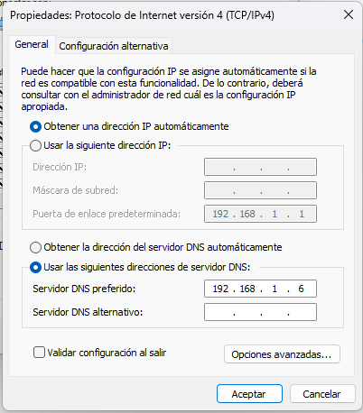

# 3. Servidor Intranet
Aquel que hace una pregunta es un tonto por un minuto; aquel que no la hace permanece tonto para siempre.
Proverbio chino

Una vez terminada la configuración básica de un sistema servidor, es momento de expandir su funcionalidad para ofrecer un conjunto de servicios a la red interna y a sus usuarios.

- __[3.1 DNS](#3-dns)__
    - __[3.1.1 El Protocolo DNS](#311-el-protocolo-dns)__
    - __[3.1.2 Caché DNS](#312-cache-dns)__
    - __[3.1.3 Servidor DNS Local](#313-servidor-dns-local)__

3.2 DHCP
3.2.1 El Protocolo DHCP
3.2.2 Servidor DHCP

3.3 Proxy de Internet
3.3.1 Caché Web: Squid

3.4 Base de Datos
3.4.1 Servidor MySQL: MariaDB

3.5 Certificados SSL
3.5.1 Certificados Autogenerados
3.5.2 Certificados LetsEncrypt

3.6 Antivirus
3.6.1 ClamAV

3.7 Antispam
3.7.1 SpamAssassin

3.8 Control de Versiones
3.8.2 Git

3.9 Compartición de Archivos
3.9.1 Servidor SMB: Samba


3.10 Servidor Multimedia
3.10.1 Servidor DLNA


## 3.1 DNS
> El que hace una pregunta es un tonto por un minuto; el que no lo hace, permanece tonto para siempre.
> 
> __Proverbio chino__

Una vez terminada la configuración básica de un sistema servidor, es hora de expandir su funcionalidad para proporcionar un conjunto de servicios a la red interna y a sus usuarios.

El __DNS (Domain Name System - Sistema de Nombres de Dominio)__ es un sistema de resolución de nombres y direcciones IP.

Es el __DNS__ el que informa, por ejemplo, que el servidor www.debian.org tiene la dirección IPv6 2801:82:80ff:8009:e61f:13ff:fe63:8e88: y viceversa.

### 3.1.1 El Protocolo DNS

__Sistema de Nombres de Dominio__

Siempre que se utiliza un nombre para designar un servidor, como www.debian.org, este debe ser traducido a la dirección IP única de dicho servidor. Este proceso se denomina resolución y se lleva a cabo gracias al Sistema de Nombres de Dominio o DNS (Domain Name System).

Este sistema está compuesto por una red global de servidores organizados en forma de árbol, cada uno conteniendo una tabla de asociaciones de nombres de servidores y sus respectivas direcciones IP.

__Cómo funciona el DNS__

Supongamos que se desea contactar al servidor www.google.com. El sistema iniciará una serie de contactos con diversos otros sistemas para encontrar la dirección asociada al nombre solicitado. Una versión muy simplificada del proceso sería la siguiente: probablemente, el sistema deberá contactar a su servidor DNS, que a su vez consultará a los servidores DNS de nivel superior para indagar sobre el dominio “google.com” y, posteriormente, contactar al servidor DNS de Google para obtener la dirección IP de www.google.com.

Aunque cada consulta o resolución toma apenas unos milisegundos, la visualización de una página web en un navegador puede verse significativamente afectada por este proceso, especialmente considerando que los diferentes elementos de la página pueden estar alojados en diversos servidores, cuyas direcciones deben resolverse individualmente.

### 3.1.2 Cache DNS

Aunque las direcciones de Internet tengan nombres "legibles" (www.google.com), estos deben ser traducidos a la dirección IP (213.129.232.18) del servidor correspondiente. Esta conversión se realiza mediante una consulta al Sistema de Nombres de Dominio o DNS (Domain Name System).

Una caché DNS almacena localmente los resultados de estas consultas para uso futuro, evitando la repetición de búsquedas y aumentando drásticamente la velocidad de respuesta.

__Instalación__
```bash
root@potosi:~# apt install bind9 bind9-doc dnsutils
```

__Configuración__

La configuración generada durante la instalación es completamente funcional sin realizar cambios. Sin embargo, personalizaremos algunos aspectos.

La configuración se guarda en el archivo /etc/bind/named.conf.options.

Primero, aseguraremos que solo se respondan solicitudes de resolución provenientes del propio host (127.0.0.1 o ::1) o de una dirección de la red interna (192.168.1.0/24). Todas las demás serán ignoradas para evitar usos indebidos de nuestro servidor DNS por parte de terceros. Esta lista de control de acceso (ACL), que llamaremos internals, se define en /etc/bind/named.conf.options:

```bash
root@potosi:~# nano /etc/bind/named.conf.options

acl internals {
        127.0.0.0/8;
        ::1/128;
        192.168.1.0/24;
};
```

Luego, definimos a qué servidores solicitará ayuda nuestro servidor para la resolución de nombres en caso de no poder hacerlo localmente (forwarders).

Como forwarders, podemos usar los servidores DNS de nuestro proveedor de Internet o servicios públicos de DNS como:

- [OpenDNS](https://www.opendns.com/)
- [Google Public DNS](https://developers.google.com/speed/public-dns?csw=1&hl=es-419)
- [The OpenNIC Project](https://opennic.org/)

En este caso, utilizaremos los servidores públicos de [Cloudflare](https://one.one.one.one/) y, por redundancia, también los de [Google Public DNS](https://developers.google.com/speed/public-dns?hl=es-419).

```bash
root@potosi:~# nano /etc/bind/named.conf.options

options {
        directory "/var/cache/bind";
        forwarders {
                // Cloudflare Public DNS (IPv4)
                1.1.1.1;
                1.0.0.1;
                // Cloudflare Public DNS (IPv6)
                2606:4700:4700::1111;
                2606:4700:4700::1001;
                // Google Public DNS (IPv4)
                8.8.8.8;
                8.8.4.4;
                // Google Public DNS (IPv6)
                2001:4860:4860::8888;
                2001:4860:4860::8844;
        };
        dnssec-validation auto;
        auth-nxdomain no;    # conform to RFC1035
};
```

Finalmente, fortalecemos la seguridad para garantizar que el servidor solo sea utilizado por nuestra red interna.

```bash
root@potosi:~# nano /etc/bind/named.conf.options
options {
        // Security options
 
        // Listen on local interfaces only
        listen-on { 127.0.0.1; 192.168.1.100; };
        listen-on-v6 { ::1; };
 
        // Accept requests for internal network only
        allow-query { internals; };
 
        // Allow recursive queries to the local hosts
        allow-recursion { internals; };
 
        // Do not transfer the zone information to the secondary DNS
        allow-transfer { none; };
 
        // Do not make public version of BIND
        version none;
};
```

Verificación de la configuración
Verificar si el archivo de configuración fue editado correctamente:

```bash
root@potosi:~# named-checkconf
/etc/bind/named.conf.options:38: 'dnssec-validation' redefined near 'dnssec-validation'
```

Actualizar el archivo /etc/resolv.conf para que la resolución de nombres se realice localmente:

```bash
root@potosi:~# nano /etc/resolv.conf

nameserver 127.0.0.1
nameserver ::1
```

Verificar también en /etc/nsswitch.conf que la resolución de nombres pase por el servicio DNS:

```bash
root@potosi:~# cat /etc/nsswitch.conf

# [...]
hosts:  files dns
# [...]
```

Reiniciar el servicio DNS:

```bash
root@potosi:~# systemctl restart bind9
```

__Verificación__

Consultar la dirección IP de cualquier sitio:

```bash
root@potosi:~# nslookup www.debian.org
Server:         127.0.0.1
Address:        127.0.0.1#53

Non-authoritative answer:
Name:   www.debian.org
Address: 200.17.202.197
Name:   www.debian.org
Address: 2603:400a:ffff:bb8::801f:3e
```

El proceso inverso también debería funcionar:

```bash
root@potosi:~# nslookup 200.17.202.197
197.202.17.200.in-addr.arpa     name = debiansec.c3sl.ufpr.br.

Authoritative answers can be found from:
```

__Configuración de clientes__

__Linux__

Editar /etc/resolv.conf y añadir o reemplazar el nameserver con la dirección IP de nuestro servidor:

```bash
root@cliente:~# nano /etc/resolv.conf
#ip del servidor
nameserver 192.168.1.6
```

__Windows__
En las propiedades del protocolo Internet (TCP/IPv4) de la conexión de red, indicar la dirección de nuestro servidor DNS (192.168.1.6) como servidor DNS preferido.



__Configuración automática de clientes__

El servidor DNS también puede asignarse automáticamente mediante DHCP añadiendo la opción domain-name-servers en /etc/dhcp/dhcpd.conf:

```bash
root@potosi:~# nano /etc/dhcp/dhcpd.conf

option domain-name-servers 192.168.1.100;
```


### 3.1.3 Servidor DNS Local

Aunque se puedan asignar nombres a los distintos sistemas de una red, estos no se pueden reconocer entre sí sin un sistema de resolución de nombres. Para que un sistema pueda localizar la dirección IP asociada al nombre de otro sistema, es necesario que este esté registrado en un servidor DNS, de manera que permita la resolución de nombres.

> __Atención__
> Antes de instalar el servidor DNS, es importante asegurarse de que la caché DNS ya esté previamente configurada y probada.

__Instalación__

```bash
root@potosi:~# apt install bind9 bind9-doc dnsutils
```

__Configuración__

La resolución de nombres convierte los nombres de los sistemas en sus direcciones IP y viceversa. Por tanto, la configuración consiste básicamente en la creación de 2 zonas: una (zone "home.lan") que convierte nombres en direcciones IP, y otra (zone "1.168.192.in-addr.arpa") que convierte direcciones IP en los nombres correspondientes.

Zonas
Las zonas se declaran en el archivo /etc/bind/named.conf.local:

```bash
root@potosi:~# nano /etc/bind/named.conf.local

//
// Do any local configuration here
//

zone "home.lan" {
    type master;
    file "/etc/bind/db.home.lan";
};

zone "1.168.192.in-addr.arpa" {
    type master;
    file "/etc/bind/db.1.168.192";
};

// Consider adding the 1918 zones here, if they are not used in your
// organization
//include "/etc/bind/zones.rfc1918";
```

Verificar que el archivo de configuración no contiene errores:

```bash
root@potosi:~# named-checkconf
```

__Resolución de nombres__

La resolución de nombres transforma los nombres de los sistemas en sus direcciones IP correspondientes.

Para la zona home.lan, los nombres server, virtual, ns y router están asociados a sus respectivas direcciones. La base de datos para la resolución de nombres en la zona home.lan se guarda en el archivo /etc/bind/db.home.lan:

```bash
root@potosi:~# nano /etc/bind/db.home.lan

;
; BIND zone file for home.lan
;

$TTL    3D
@       IN      SOA     @               root.home.lan. (
                        2017061201      ; serial
                        8H              ; refresh
                        2H              ; retry
                        4W              ; expire
                        1D )            ; minimum
;
@               NS      ns              ; Inet address of name server
@               MX      10 mail         ; Primary mail exchanger

ns              A       192.168.1.100
mail            A       192.168.1.100

home.lan.       A       192.168.1.100
server          A       192.168.1.100

virtual         A       192.168.1.101

router          A       192.168.1.1     ; router ADSL
gateway         CNAME   router
gw              CNAME   router
```

El protocolo DNS también permite la creación de alias o nombres canónicos (CNAME), que son identificados por el tipo de registro CNAME. Un alias es un nombre alternativo para un sistema.

Al final del archivo se pueden declarar algunos alias: el sistema server también podrá ser conocido como proxy, www y ftp:

```bash
root@potosi:~# nano /etc/bind/db.home.lan

// [...]
proxy           CNAME   server
www             CNAME   server
ftp             CNAME   server
// [...]
```

Verificar que el archivo de configuración de la zona home.lan no contiene errores:

```bash
root@potosi:~# named-checkzone home.lan /etc/bind/db.home.lan
zone home.lan/IN: loaded serial 2017061201
OK
```

__Resolución inversa__

La resolución inversa transforma direcciones IP en los nombres correspondientes de los sistemas.

La resolución inversa está implementada en el archivo /etc/bind/db.1.168.192:

```bash
root@potosi:~# nano /etc/bind/db.1.168.192

;
; BIND zone file for 192.168.1.xxx
;

$TTL    3H
@       IN      SOA     @               root.home.lan. (
                        2017061201      ; serial
                        8H              ; refresh
                        2H              ; retry
                        4W              ; expire
                        1D )            ; minimum
;
@               NS      ns.home.lan.    ; Nameserver address

100             PTR     server.home.lan.
100             PTR     ns.home.lan.
100             PTR     mail.home.lan.
101             PTR     virtual.home.lan.
1               PTR     router.home.lan.
```

Verificar que el archivo de configuración de la zona 1.168.192.in-addr.arpa no contiene errores:

```bash
root@potosi:~# named-checkzone 1.168.192.in-addr.arpa /etc/bind/db.1.168.192
zone 1.168.192.in-addr.arpa/IN: loaded serial 2017061201
OK
```

Verificar también que bind9 puede leer todas las zonas:

```bash
root@potosi:~#  named-checkconf -z
zone home.lan/IN: loaded serial 2017061201
zone 1.168.192.in-addr.arpa/IN: loaded serial 2017061201
zone localhost/IN: loaded serial 2
zone 127.in-addr.arpa/IN: loaded serial 1
zone 0.in-addr.arpa/IN: loaded serial 1
zone 255.in-addr.arpa/IN: loaded serial 1
```

Reiniciar el servicio:

```bash
root@potosi:~# systemctl restart bind9
```

Agregar el dominio home.lan al archivo /etc/resolv.conf:

```bash
root@potosi:~# nano /etc/resolv.conf
domain home.lan
search home.lan
nameserver 127.0.0.1
```

Así, cuando nos refiramos al sistema server, se buscará dentro del dominio home.lan, resultando en el nombre completo server.home.lan.

__Verificación__

Verificar la resolución de nombres:
```bash
root@potosi:~#  nslookup server
Server:         127.0.0.1
Address:        127.0.0.1#53

Name:   server.home.lan
Address: 192.168.1.4
```

Verificar que los alias también se resuelven correctamente:

```bash
root@potosi:~# nslookup gateway
Server:         127.0.0.1
Address:        127.0.0.1#53

gateway.home.lan        canonical name = router.home.lan.
Name:   router.home.lan
Address: 192.168.1.1
```

Finalmente, verificar la resolución inversa:

```bash
root@potosi:~# nslookup 192.168.1.4
4.1.168.192.in-addr.arpa        name = ns.home.lan.
4.1.168.192.in-addr.arpa        name = virtual.home.lan.
4.1.168.192.in-addr.arpa        name = server.home.lan.
4.1.168.192.in-addr.arpa        name = mail.home.lan.
```


3.2 DHCP
3.2.1 El Protocolo DHCP
3.2.2 Servidor DHCP

3.3 Proxy de Internet
3.3.1 Caché Web: Squid

3.4 Base de Datos
3.4.1 Servidor MySQL: MariaDB

3.5 Certificados SSL
3.5.1 Certificados Autogenerados
3.5.2 Certificados LetsEncrypt

3.6 Antivirus
3.6.1 ClamAV

3.7 Antispam
3.7.1 SpamAssassin

3.8 Control de Versiones
3.8.2 Git

3.9 Compartición de Archivos
3.9.1 Servidor SMB: Samba


3.10 Servidor Multimedia
3.10.1 Servidor DLNA


